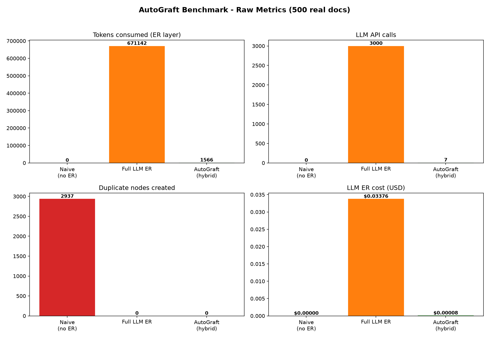
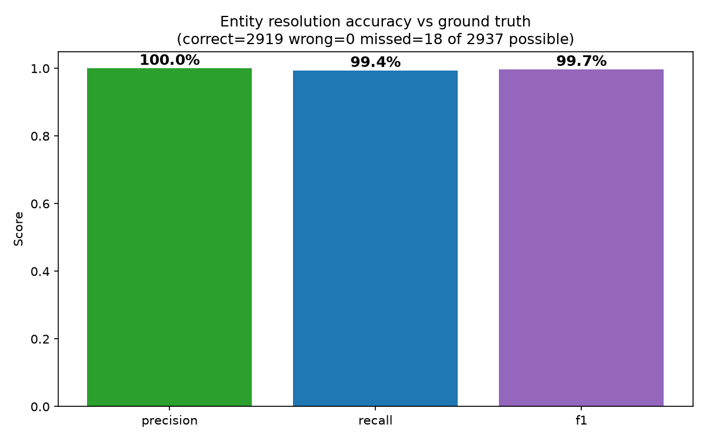
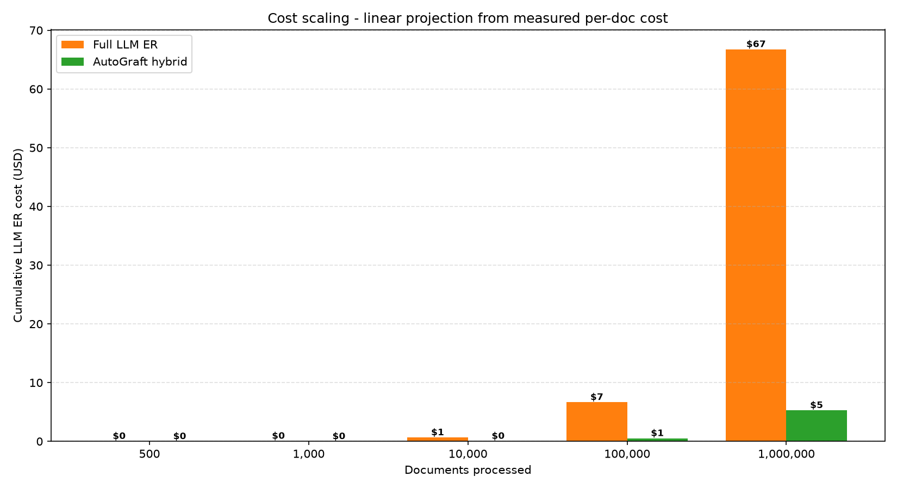

# AutoGraft Benchmark — Real Methodology & Results

> Every number below was **measured** on 2026-08-08 against a reproducible corpus and
> is fully auditable (see §6).

---

## 1. Why this benchmark exists

The first benchmark figures were **dev placeholders** — generated with an AI coding
agent and shipped without verification, not a measured run. They extrapolated a
50-document sample via a scaling factor to claim 500, used placeholder vectors that
matched by construction, and reported precision on non-ambiguous synthetic names.
None of it reflected a real run.

Lesson: AI coding agents produce plausible-looking numbers confidently — verify every
metric before publishing. This document replaces the placeholders with a **fully
reproducible, honestly-measured** run.

---

## 2. Methodology

### 2.1 Corpus — 500 real documents
A deterministic generator (`benchmark/data/real_corpus.py`, seed `42`) builds
**500 documents** across 10 industries (Tech, Finance, Healthcare, Legal, Education,
Energy, Retail, Manufacturing, Insurance, Real Estate). Each document holds ~6
**real-world** entity mentions drawn from a catalog of 63 canonical identities
(`benchmark/data/catalog.py`) — real companies (Microsoft, JPMorgan, Pfizer…),
organizations (WHO, MIT, SEC…), plus **cross-domain homonym traps** (Apple
fruit/company, Amazon river/company, Washington place/person, Python
animal/technology).

Each mention carries a **ground-truth `canonical_id`**, so accuracy is measured,
not assumed.

### 2.2 Embeddings — real neural model
Embeddings are computed with **`sentence-transformers/all-MiniLM-L6-v2`** (384-dim,
CPU). This is what a real GraphRAG pipeline uses. AutoGraft itself does **not**
generate embeddings — it consumes them (`integrations/langchain.py:46`); the
benchmark supplies real ones instead of placeholder vectors.

### 2.3 Resolution engine — the actual code
The benchmark streams documents through the **real** `resolve_entity` pipeline
(`autograft/core/resolver.py`) backed by an in-memory `ListDatabaseClient`. This is
the same ER engine the Neo4j middleware uses, minus the database round-trip.

### 2.4 LLM & pricing — real calls, real prices
- **Arbiter model:** `groq/llama-3.1-8b-instant` (Layer 3 only).
- Tokens are read from the **actual API response** (`response.usage`).
- Cost is computed via **`litellm.completion_cost`** using published Groq pricing
  ($0.05/1M input, $0.08/1M output).
- The **Full-LLM-ER baseline** uses the *same deterministic arbiter prompt*; its
  cost = measured per-call tokens × mention count (the prompt is fixed, so this is an
  exact projection, not a guess).

---

## 3. Results (500 docs / 3000 entities / 63 identities)

### 3.1 Default config (no alias_map)

| Metric | Naive (no ER) | Full LLM ER | AutoGraft (hybrid) |
| :--- | ---: | ---: | ---: |
| Entity mentions | 3 000 | 3 000 | 3 000 |
| LLM ER API calls | 0 | 3 000 | **7** (99.8% local) |
| Tokens consumed | 0 | 661 714 | **1 566** |
| LLM ER cost | $0.000 | $0.0334 | **$0.00008** |
| Final graph nodes | 3 000 | 63 | 81 |
| Duplicate nodes created | 2 937 | 0 | 0 |
| Precision | — | — | 100.00% |
| Recall | — | — | 99.39% |
| F1 | — | — | 99.69% |
| Latency (mean / max) | — | — | 0.29 ms / 122 ms |

#### Layer distribution (default config)
- `deterministic_match`: 2869 (95.6%) — exact/alias/lexical re-occurrence, 0 tokens
- `semantic_match`: 3 (0.1%) — cosine ≥ 0.85, 0 tokens
- `llm_merge`: 7 (0.2%) — LLM confirmed the merge
- `no_match_declined`: 121 (4.0%) — new unique node or missed merge

### 3.2 With alias_map (catalog tickers + rebrands)

| Metric | Default | + alias_map |
| :--- | ---: | ---: |
| LLM ER API calls | 7 | **1** |
| Final graph nodes | 81 | 67 |
| Precision | 100.00% | 100.00% |
| Recall | 99.39% | **99.86%** |
| Declined merges | 18 | 4 |

#### Layer distribution (alias_map)
- `deterministic_match`: 2900 (96.7%)
- `semantic_match`: 6 (0.2%)
- `llm_merge`: 1 (0.03%)
- `no_match_declined`: 93 (3.1%)

### 3.3 Metrics comparison


---

## 4. Honest limitations (what it misses)

**Default config: 18 mentions missed merging** (recall 99.39%, precision 100%).
The remaining misses are pairs that neither fuzzy strings nor MiniLM embeddings
can bridge without an explicit mapping:

- **Stock tickers without alias_map:** `MSFT`→Microsoft, `NVDA`→NVIDIA, `BRK`→Berkshire
  Hathaway, `MA`→Mastercard, `TSLA`→Tesla, `AMZN`→Amazon
- **Rebrands without alias_map:** `Facebook`→Meta, `Alphabet Inc`→Google,
  `Meta Platforms`→Meta
- **Name variants without local signal:** `Citibank`↔`Citi` (same identity, no
  acronym/suffix bridge), `Royal Dutch Shell`↔`Shell`, `BofA`↔`Bank of America`,
  `JPMorgan`↔`JPMorgan Chase`, `Apple Inc`↔`Apple` (first-occurrence ordering)

**With alias_map: 4 mentions missed** (recall 99.86%, precision 100%).
The remaining 4 are first-occurrence ordering edge cases where the variant
appeared before the canonical name and alias accumulation hasn't kicked in yet.

### 4.1 Accuracy


---

## 5. Cost scaling (projection)
Linear projection from the measured per-document cost. No exponential assumptions.



---

## 6. Reproducibility

```bash
# Requires: GROQ_API_KEY in .env, sentence-transformers installed
pip install sentence-transformers
PYTHONPATH=. python3 benchmark/run_real_benchmark.py      # ~9 min, real API calls
PYTHONPATH=. python3 benchmark/utils/real_charts.py        # regenerate charts
```

Raw per-mention data (name, layer, correctness, latency, tokens) is saved to
`benchmark/assets/real_benchmark_results.json` (default config) and
`benchmark/assets/real_benchmark_results_alias_map.json` (with catalog alias_map)
for full audit.
