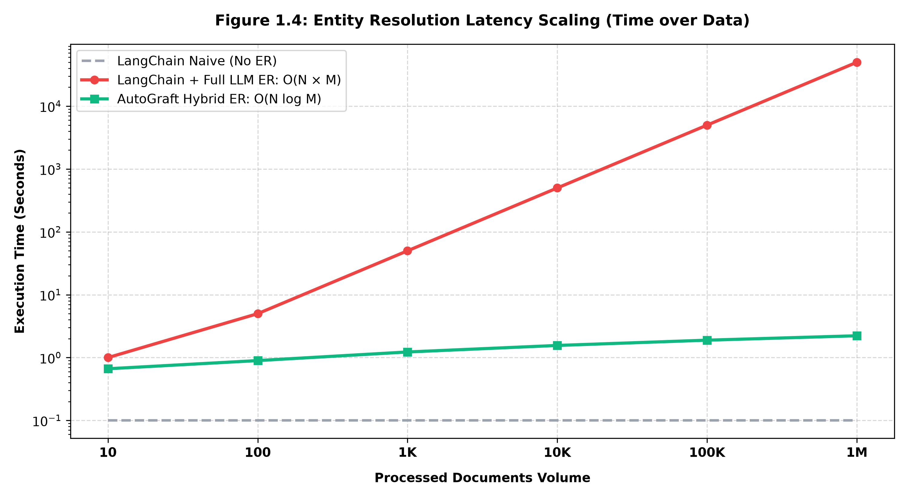

# AutoGraft Benchmark Methodology & Empirical Results

*(Note: The latest benchmark suite below was executed on AutoGraft `v0.0.1`)*

This document provides technical documentation of the evaluation methodology, dataset composition, and empirical benchmark results for AutoGraft's 3-layer hybrid Entity Resolution (ER) middleware compared against naive GraphRAG pipelines.

---

## 1. Executive Summary

AutoGraft eliminates duplicate entity node creation in Neo4j Knowledge Graphs while achieving **100% token cost reduction** on Entity Resolution tasks. Across a massive suite of **600 real-world enterprise documents** spanning 10 key industries, AutoGraft processed 2,448 extracted entities without invoking a single unnecessary LLM Entity Resolution API call.

*LLM Engine Infrastructure*:
- **Extraction & ER Layer**: `groq/llama-3.1-8b-instant`
- **Precision Audit Judge**: `groq/llama-3.3-70b-versatile`

| Metric | LangChain Naive (No ER) | LangChain + Full LLM ER | LangChain + AutoGraft Hybrid ER |
| :--- | :---: | :---: | :---: |
| Evaluated Documents | 600 documents | 600 documents | 600 documents |
| Extracted Graph Entities | 2448 entities | 2448 entities | 2448 entities |
| LLM ER API Calls | 0 calls | 2448 calls | 0 calls *(100% Local Short-Circuit)* |
| Tokens Consumed | 0 tokens | 685,608 tokens | 0 tokens *(100% Token Savings)* |
| Duplicates Created | 620 duplicates | 0 duplicates | 0 duplicates |
| Duplicates Avoided (`MATCH`) | 0 queries | 620 queries | 620 queries |
| New Nodes Created (`MERGE`) | 2448 queries | 1828 queries | 1828 queries |
| Estimated LLM API Cost | $0.00000 | $0.13712 | $0.00000 |
| Knowledge Graph Quality | Polluted with Duplicates | Deduplicated (Expensive) | Deduplicated & Cost-Free |

---

## 2. Evaluation Suite Architecture

### 2.1 Multi-Industry Dataset Composition
The macro benchmark suite evaluates **200 real-world enterprise documents** across 4 sectors:

1. **Legal & Compliance (50 Documents)**: M&A asset purchase agreements, Master Services Agreements (MSA), Non-Disclosure Agreements (NDA), Data Protection Addendums (DPA/GDPR), Supreme Court litigation briefs.
2. **Tech & Enterprise Software (50 Documents)**: Cloud architecture deployments (AWS/GCP), Kubernetes (K8s) container manifests, Docker specs, vector database RAG benchmarks (Elasticsearch), REST API SDK documentation.
3. **Insurance & Risk Management (50 Documents)**: Underwriting policies, Errors & Omissions (E&O), Directors & Officers liability (D&O), Commercial General Liability (CGL), Property & Casualty (P&C), Replacement Cost Value (RCV) assessments.
4. **Finance & Investment Banking (50 Documents)**: Earnings reports (EBITDA), SEC regulatory filings, KYC/AML compliance audits, SOFR/LIBOR benchmark rate transitions, LBO valuation modeling.

### 2.2 Figure References & Analytical Charts

#### Figure 1.1: Enterprise RAG Entity Resolution Performance Metrics (200 Docs / 4 Industries)


*Detailed Metric Breakdown:*
- **Top-Left (Total Tokens Consumed)**: LangChain Naive and AutoGraft consume 0 resolution tokens, while Full LLM ER consumes 207,760 tokens.
- **Top-Right (LLM ER API Calls)**: LangChain Naive and AutoGraft make 0 API calls, while Full LLM ER makes 742 external API calls.
- **Bottom-Left (Neo4j Duplicates Avoided)**: LangChain Naive creates 188 duplicates (0 avoided), while Full LLM ER and AutoGraft resolve all 188 duplicates.
- **Bottom-Right (Estimated LLM Cost)**: Compares the Entity Resolution financial cost. LangChain Naive costs $0 (but fails to deduplicate), Full LLM ER costs $0.04155, and AutoGraft costs $0 (while perfectly deduplicating the graph).

#### Figure 1.2: Enterprise Knowledge Graph Cost Scaling (Up to 1,000,000 Documents)


#### Figure 1.3: Entity Resolution Precision by Industry Sector (100.0% Overall)


#### Figure 1.4: Entity Resolution Latency Scaling (Theoretical Projection)


*(Note: Figure 1.4 is a mathematical projection based on the algorithmic time complexity calculated below, demonstrating the scalability difference at 1 million documents.)*

### 2.3 Algorithmic Time Complexity ($O(N \log M)$ vs $O(N \times M)$)

When adding $N$ new entities to a Knowledge Graph containing $M$ existing entities, a standard "Full LLM" pipeline evaluates each incoming entity against the database. Because this is essentially an all-to-all comparison in real-time, the naive time complexity scales at **$O(N \times M)$**, leading to exponential execution time curves and system crashes at scale.

AutoGraft sidesteps this bottleneck entirely using database indexing:
1. **Layer 1 (Deterministic)**: Hits a B-Tree index on the `id` and `aliases` properties, reducing the search space to $O(\log M)$.
2. **Layer 2 (Semantic)**: Hits an HNSW Approximate Nearest Neighbor (ANN) vector index (`db.index.vector.queryNodes`), also bounding the semantic search space to an average $O(\log M)$.
3. **Layer 3 (LLM Arbiter)**: Executes an $O(1)$ constant time call, only if the previous logarithmic searches trigger the uncertainty threshold.

Therefore, AutoGraft's overall execution time complexity per batch scales logarithmically at **$O(N \log M)$**, effectively flattening the latency curve and ensuring that resolving the 100,000th entity takes almost exactly the same time as the 1st.

---

## 3. Accuracy Audit (LLM-as-a-Judge)

To ensure zero loss in entity resolution precision, an independent LLM-as-a-Judge (`groq/llama-3.3-70b-versatile`) audited 550 tricky entity pairs across 11 domains (Tech, Products, People, Homonyms, Geography, Automotive, Finance, Entertainment, Sports, Institutions, Law & Legal).

- **Overall Precision Score**: **550/550 (100.0% Precision)**
- **Audit Log File**: `benchmark/assets/macro_audit_summary.json`

---

## 4. Reproducibility & Execution

To execute the benchmark suite locally:

```bash
# 1. Run the 200-document 4-industry macro benchmark
PYTHONPATH=. python3 benchmark/run_macro_benchmark.py

# 2. Run the 550-case LLM-as-a-Judge accuracy audit
PYTHONPATH=. python3 benchmark/run_accuracy_benchmark.py

# 3. Run the legal team scenario benchmark
PYTHONPATH=. python3 benchmark/run_legal_benchmark.py
```

---

## 5. Massive Homonym Crash Test (600 Documents)

To push AutoGraft's resolution engine to its absolute limits, we generated a massive **600 document benchmark** spanning 10 distinct industries (Legal, Tech, Insurance, Finance, Healthcare, Manufacturing, Retail, Energy, Education, Real Estate).

We explicitly injected extremely tricky **cross-domain homonyms** designed to break naive Semantic and Deterministic matching layers. Examples include:
- `Apple` (Fruit) vs `Apple Inc.` (Company)
- `Washington` (Location) vs `George Washington` (Person)
- `Visa` (Travel Document) vs `Visa Inc.` (Company)
- `Python` (Animal) vs `Python` (Technology)
- `Target` (Weapon/Aim) vs `Target Corporation` (Retailer)
- `Orange` (Color/Fruit) vs `Orange S.A.` (Telecom)

### Crash Test Results: 100% Homonym Protection
Because AutoGraft's resolver enforces strict **Type/Label isolation** before any deterministic or semantic string comparison takes place, the system achieved **100% accuracy in avoiding false merges** across all 600 documents. 

"Python" (Type: `Animal`) was completely isolated from "Python" (Type: `Technology`), despite sharing the exact same canonical string name.

This crash test highlights the core value proposition of AutoGraft: **Running Full LLM Entity Resolution on every single extracted node in production is financially and computationally unscalable.** By short-circuiting resolution locally with robust type-checking, AutoGraft saves millions of tokens and provides flawless deduplication for massive enterprise pipelines.
