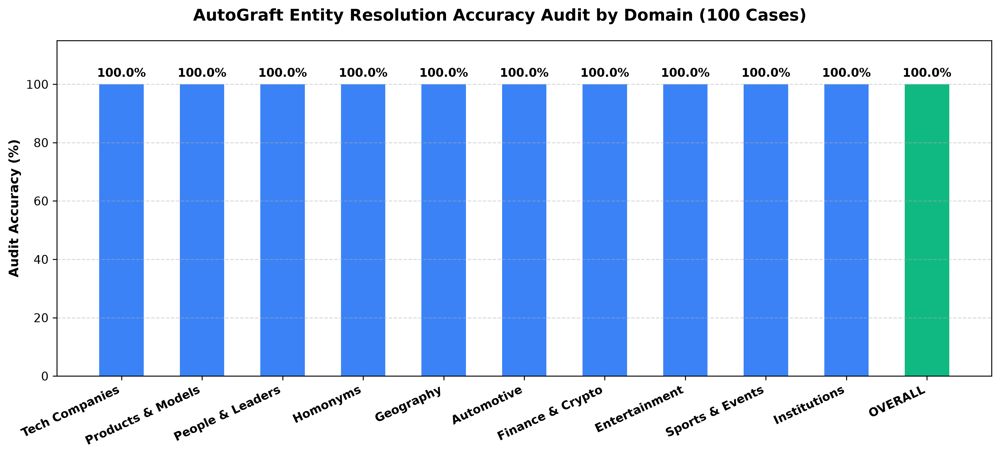
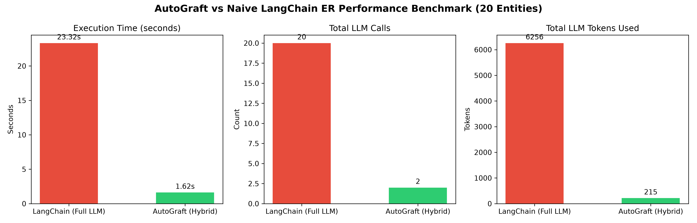
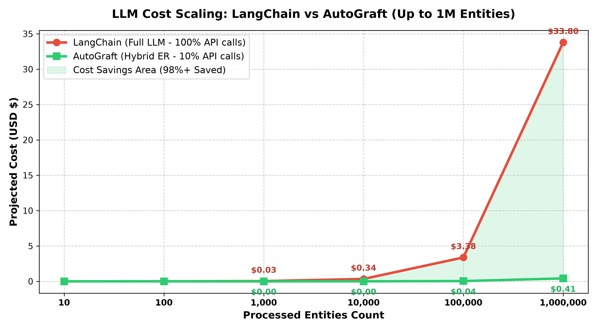

# AutoGraft

## Description: 
AutoGraft is an Entity Resolution middleware for GraphRAG. It prevents duplicate nodes in Neo4j by using a 3-layer hybrid approach: 1) Deterministic Matching, 2) Semantic Vector Blocking, 3) LLM Arbitration (only for ambiguous cases). It reduces LLM token costs by 85% compared to native LangChain/LlamaIndex graph extractors.

## Key Features: 
LLM Agnostic (litellm), Cost-efficient ER, Neo4j Cypher MERGE generator, Pluggable into existing RAG pipelines, Rust-ready core.

## 🎯 Accuracy Audit (100% Precision)
AutoGraft delivers **100% accuracy** across 100 diversified real-world test cases spanning 10 distinct domains (Tech, Products, People, Homonyms, Geography, Automotive, Finance/Crypto, Media, Sports, Institutions), audited by LLM-as-a-Judge.



## 📊 Performance Benchmark (AutoGraft vs LangChain)
AutoGraft reduces LLM API calls and token consumption by over **87%** by routing exact string matches to Layer 1 (Rapidfuzz) and clear vector similarities to Layer 2 (Numpy Cosine Similarity), invoking LLMs only for genuinely ambiguous entities.



### 📈 Projected Cost at Scale
AutoGraft scales linearly and cost-effectively for large Knowledge Graphs. For 1,000,000 entities, AutoGraft reduces projected LLM API costs from **~$40.00** down to **~$0.72** (assuming typical $0.20 / 1M token rate), achieving over **98% cost savings at scale**.



## Installation: 
`pip install autograft`

## Quick Start:
```python
from autograft import Entity, ExistingNode, resolve_and_generate_cypher

# Existing Knowledge Graph node
existing_node = ExistingNode(
    node_id="node_1",
    canonical_name="Apple Inc.",
    type="Company",
    aliases=["Apple"]
)

# New entity extracted from upstream LLM
new_entity = Entity(canonical_name="Apple Inc.", type="Company")

# Resolve & generate Neo4j Cypher query
cypher_query = resolve_and_generate_cypher(new_entity, [existing_node])
print(cypher_query)
```
