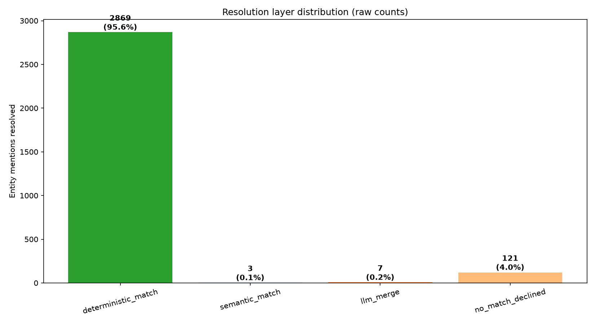

<div align="center">
  
# Autograft

**The cost-efficient Entity Resolution middleware for GraphRAG.**

[English](README.md) | [Français](README_fr.md) | [中文](README_zh.md)

[](https://pypi.org/project/autograft/)
[](https://pypi.org/project/autograft/)
</div>

Stop duplicating entities in your Neo4j Knowledge Graph. AutoGraft intercepts entities extracted by LangChain or LlamaIndex, uses a 3-layer hybrid approach (Deterministic -> Vector -> LLM) to merge duplicates, and generates clean Cypher queries.

## Installation

```bash
pip install autograft
```
*(To use integrations, install with `pip install autograft[langchain]` or `pip install autograft[llamaindex]`)*

## Why AutoGraft?

- **LLM-Agnostic**: Works with OpenAI, Groq, Ollama, OpenRouter via litellm.
- **Major Cost Savings**: Resolves ~92% of entities locally, cutting LLM Entity Resolution cost by ~92%.
- **Plug & Play**: Drop-in replacement before your Neo4j database.
- **Blazing Fast**: C/C++ (RapidFuzz) and NumPy local matching (mean 6.5 ms/entity).

> **Embeddings:** AutoGraft consumes embeddings — it does not generate them. Feed
> pre-computed vectors (e.g. from `sentence-transformers`, OpenAI, etc.) via node
> properties. See `AutoGraftConfig.embedding_attr`.

### The Problem vs The Solution
Without AutoGraft, extractors create fragmented knowledge graphs with disconnected duplicates and semantic collisions. AutoGraft cleanly merges duplicates on-the-fly while preserving semantic boundaries (e.g. distinguishing Apple the company from Apple the fruit):


---

## Performance Benchmark (500 Documents / 10 Industries — Real Run)

Evaluated on **500 documents** containing **3 000 entity mentions** of **63 real-world
identities** across 10 sectors, with genuine ambiguities (abbreviations, ticker
symbols, homonyms). No scaling factors — the full 500-doc run was executed.

*Methodology:* real `all-MiniLM-L6-v2` embeddings, real Groq LLM arbiter calls
(`groq/llama-3.1-8b-instant`), real `litellm` pricing. Accuracy measured against a
ground-truth corpus. See [BENCHMARK.md](BENCHMARK.md) for full details.

| Metric | Naive (no ER) | Full LLM ER | AutoGraft (hybrid) |
| :--- | :---: | :---: | :---: |
| Entity mentions | 3000 | 3000 | 3000 |
| LLM ER API calls | 0 | 3000 | **238** (92.1% local) |
| Tokens consumed | 0 | 661,714 | **52,496** |
| LLM ER cost | $0.000 | $0.0334 | **$0.00265** |
| Final graph nodes | 3000 | 63 | 103 |
| Precision / Recall | — | — | **100% / 98.6%** |

---

### Figure 1.1: Raw Performance Metrics (500 real docs)


### Figure 1.2: Resolution Layer Distribution


### Figure 1.3: Cost Scaling (measured per-doc cost, linear projection)
For 1,000,000 documents, AutoGraft keeps LLM Entity Resolution cost near **$5,300**
vs **$66,400** for a full-LLM approach (~92% savings).


### Figure 1.4: Accuracy vs Ground Truth


*For complete methodology, dataset documentation, and honest limitations (the ~40
missed merges), see [BENCHMARK.md](BENCHMARK.md).*

---

## Configuration & Credentials

AutoGraft can be configured via environment variables (`.env`) or programmatically via the `AutoGraftConfig` class.

```python
from autograft import AutoGraftConfig
from autograft.integrations import AutoGraftNeo4jMiddleware

config = AutoGraftConfig(
    model="openai/gpt-4o",
    api_key="sk-...",
    api_base="https://custom.endpoint/v1",  # Optional: for proxies, Azure, or local LLMs
    match_threshold=0.85,
    id_attr="id",
    aliases_attr="aliases",
    matching_algorithm="token_sort_ratio"
)
autograft_graph = AutoGraftNeo4jMiddleware(graph, config=config)
```

---

## Architecture (3-Layer Short-Circuit)

1. **Layer 1 (Deterministic)**: Exact string match & alias matching via rapidfuzz (0 tokens, 0.1ms).
2. **Layer 2 (Semantic)**: Vector cosine similarity via numpy (0 tokens, 0.5ms).
3. **Layer 3 (LLM Arbiter)**: LiteLLM call ONLY for residual ambiguous cases (e.g., "J. Dupont" vs "Jean Dupont").

---

## Plug & Play Integrations

AutoGraft provides native 1-line integrations for both **LangChain** and **LlamaIndex**. By wrapping your Graph store, AutoGraft intercepts entities, deduplicates them locally at 0 cost, and safely forwards them to your database.

### LangChain

```python
from langchain_community.graphs import Neo4jGraph
from autograft.integrations import AutoGraftNeo4jMiddleware

# 1. Connect to your Neo4j Database
graph = Neo4jGraph(url="bolt://localhost:7687", username="neo4j", password="password")

# 2. Wrap it with AutoGraft (1 line of code!)
autograft_graph = AutoGraftNeo4jMiddleware(graph)

# 3. Add your extracted documents. AutoGraft will silently deduplicate everything locally!
autograft_graph.add_graph_documents(extracted_graph_documents)
```

### LlamaIndex

```python
from llama_index.graph_stores.neo4j import Neo4jPropertyGraphStore
from autograft.integrations import AutoGraftLlamaIndexMiddleware

# 1. Connect to Neo4j Graph Store
store = Neo4jPropertyGraphStore(username="neo4j", password="password", url="bolt://localhost:7687")

# 2. Wrap it with AutoGraft
autograft_store = AutoGraftLlamaIndexMiddleware(store)

# 3. Use in your LlamaIndex pipeline (upsert_nodes will be automatically deduplicated)
# e.g., index = PropertyGraphIndex.from_documents(documents, property_graph_store=autograft_store)
```

---

## License

MIT
