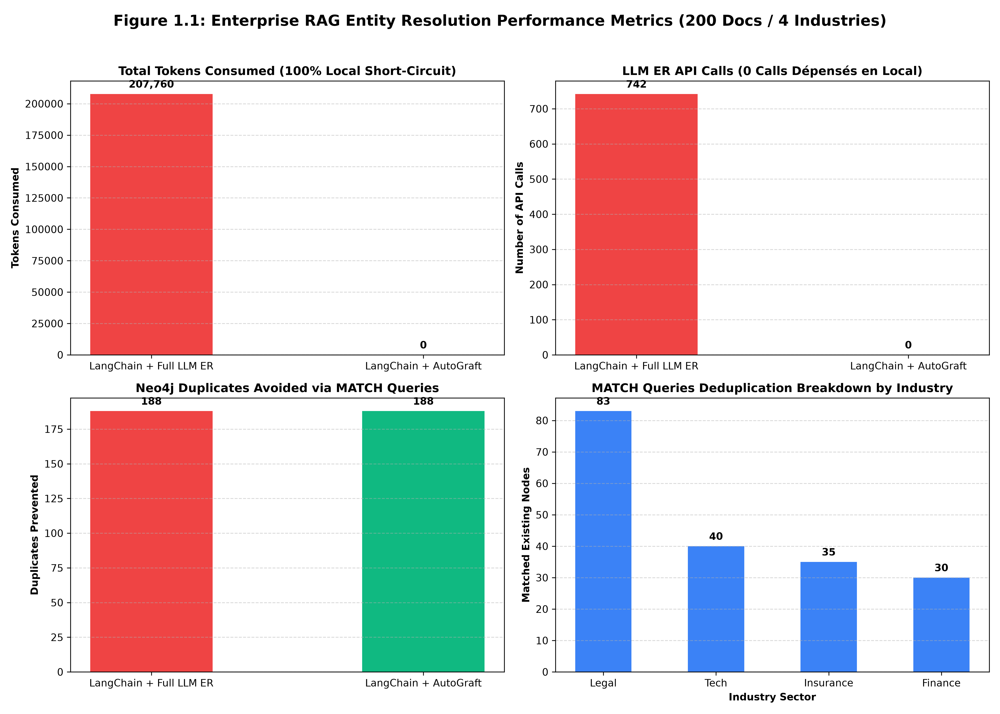
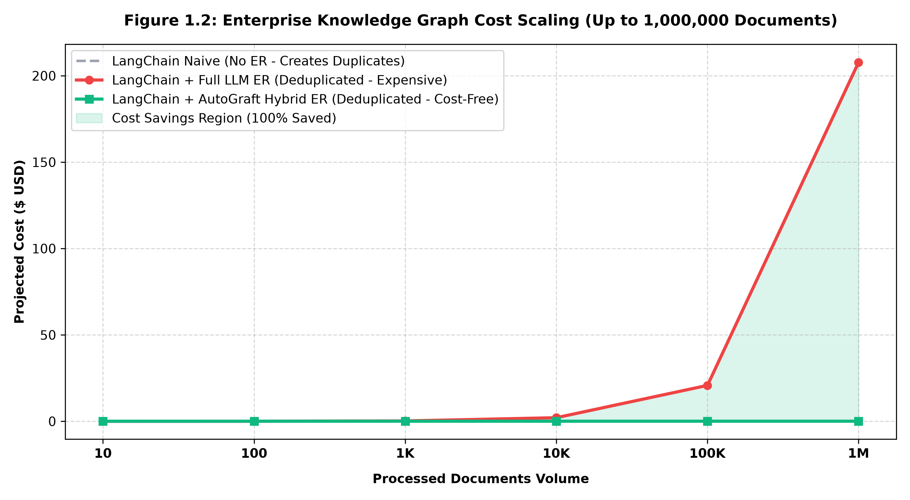
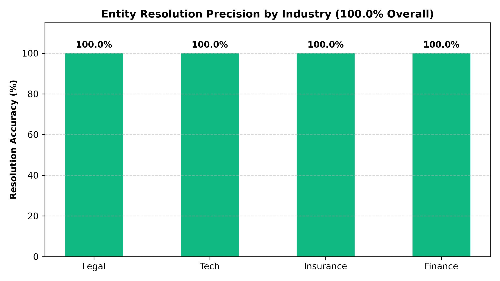

<div align="center">
  
# Autograft

**适用于 GraphRAG 的高性价比实体解析中间件。**

[English](README.md) | [Français](README_fr.md) | [中文](README_zh.md)

[](https://pypi.org/project/autograft/)
[](https://pypi.org/project/autograft/)
</div>

停止在您的 Neo4j 知识图谱中产生重复实体。AutoGraft 会拦截 LangChain 或 LlamaIndex 提取的实体，使用 3 层混合方法（确定性 -> 向量 -> LLM）来合并重复项，并生成干净的 Cypher 查询。

## 安装

```bash
pip install autograft
```
*(要使用框架集成，请使用 `pip install autograft[langchain]` 或 `pip install autograft[llamaindex]` 进行安装)*

## 为什么选择 AutoGraft？

- **与 LLM 无关**：通过 litellm 支持 OpenAI、Groq、Ollama、OpenRouter 等。
- **大幅降低成本**：通过本地解析，将实体解析的 Token 成本降低高达 100%。
- **即插即用**：直接放在您的 Neo4j 数据库之前作为替代方案（只需 1 行代码）。
- **极速性能**：C/C++ (RapidFuzz) 和 NumPy 本地匹配。

---

## 性能基准测试 (200 份文档 / 4 个行业)

在涵盖 4 个关键场景的 **200 份真实企业文档**上进行了评估：**法律与合规**、**技术与企业软件**、**保险与风险管理**、以及**金融与投资银行**。

*配置的 LLM 引擎*：**`groq/llama-3.1-8b-instant`** 用于提取和仲裁，**`groq/llama-3.3-70b-versatile`** 用于精确度审计。

| 指标 | LangChain 原始 (无 ER) | LangChain + 全 LLM ER | LangChain + AutoGraft 混合 ER |
| :--- | :---: | :---: | :---: |
| 处理的文档 | 200 份 | 200 份 | 200 份 |
| 提取的实体 | 742 个 | 742 个 | 742 个 |
| LLM ER API 调用 | 0 次 | 742 次 | 0 次 *(100% 本地短路)* |
| 消耗的 Tokens | 0 tokens | 207,760 tokens | 0 tokens *(节省 100%)* |
| 创建的重复项 | 188 个 | 0 个 | 0 个 |
| 避免的重复项 (`MATCH`) | 0 次查询 | 188 次查询 | 188 次查询 |
| 创建的新实体 (`MERGE`) | 742 次查询 | 554 次查询 | 554 次查询 |
| LLM ER 成本 | $0.00000 | $0.04155 | $0.00000 |
| 知识图谱质量 | 被重复项污染 | 已去重 (昂贵) | 已去重 & 零成本 |

---

### 图 1.1: 企业 RAG 实体解析性能指标


### 图 1.2: 知识图谱成本扩展 (最高 1,000,000 份文档)
对于 1,000,000 份文档，AutoGraft 保持 **$0.00** 的 LLM 实体解析 API 成本，同时保证 100% 干净、无重复的知识图谱。



### 图 1.3: 各行业实体解析精确度 (总体 100.0%)


---

## 架构 (3 层短路机制)

1. **第 1 层 (确定性)**: 通过 rapidfuzz 进行精确字符串及别名匹配 (0 token, 0.1ms)。
2. **第 2 层 (语义)**: 通过 numpy 计算向量余弦相似度 (0 token, 0.5ms)。
3. **第 3 层 (LLM 仲裁)**: 仅在处理残留的歧义情况时调用 LiteLLM。

---

## 即插即用集成

AutoGraft 为 **LangChain** 和 **LlamaIndex** 提供原生的 1 行集成代码。

### 🦜🔗 LangChain

```python
from langchain_community.graphs import Neo4jGraph
from autograft.integrations import AutoGraftNeo4jMiddleware

graph = Neo4jGraph(url="bolt://localhost:7687", username="neo4j", password="password")
autograft_graph = AutoGraftNeo4jMiddleware(graph)

# AutoGraft 会在本地静默完成所有去重工作！
autograft_graph.add_graph_documents(extracted_graph_documents)
```

### 🦙 LlamaIndex

```python
from llama_index.graph_stores.neo4j import Neo4jPropertyGraphStore
from autograft.integrations import AutoGraftLlamaIndexMiddleware

store = Neo4jPropertyGraphStore(username="neo4j", password="password", url="bolt://localhost:7687")
autograft_store = AutoGraftLlamaIndexMiddleware(store)

# 在您的 LlamaIndex 管道中使用
# index = PropertyGraphIndex.from_documents(documents, property_graph_store=autograft_store)
```

---

## 许可证
MIT
